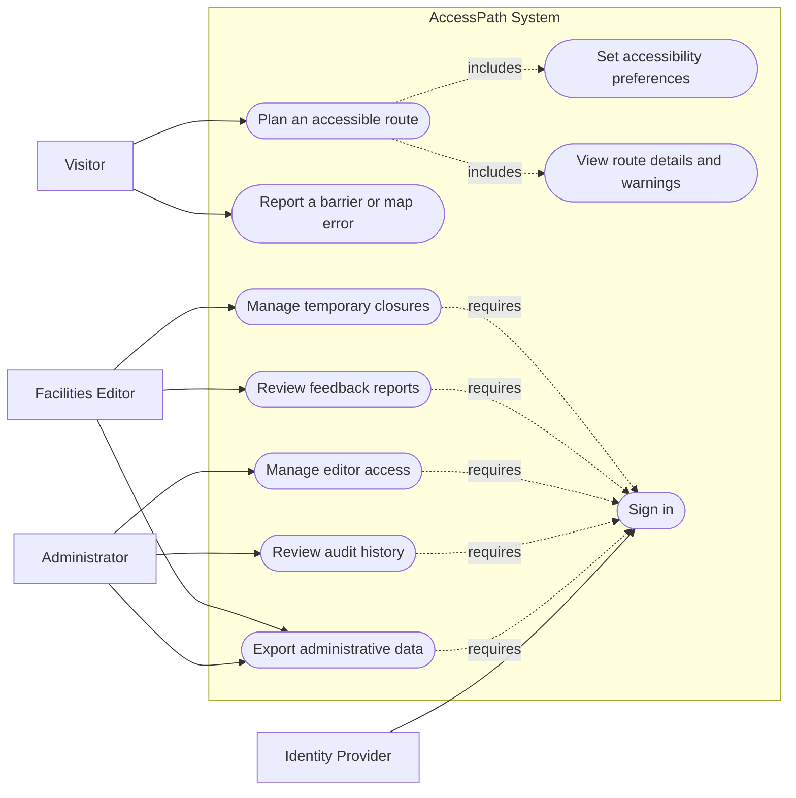
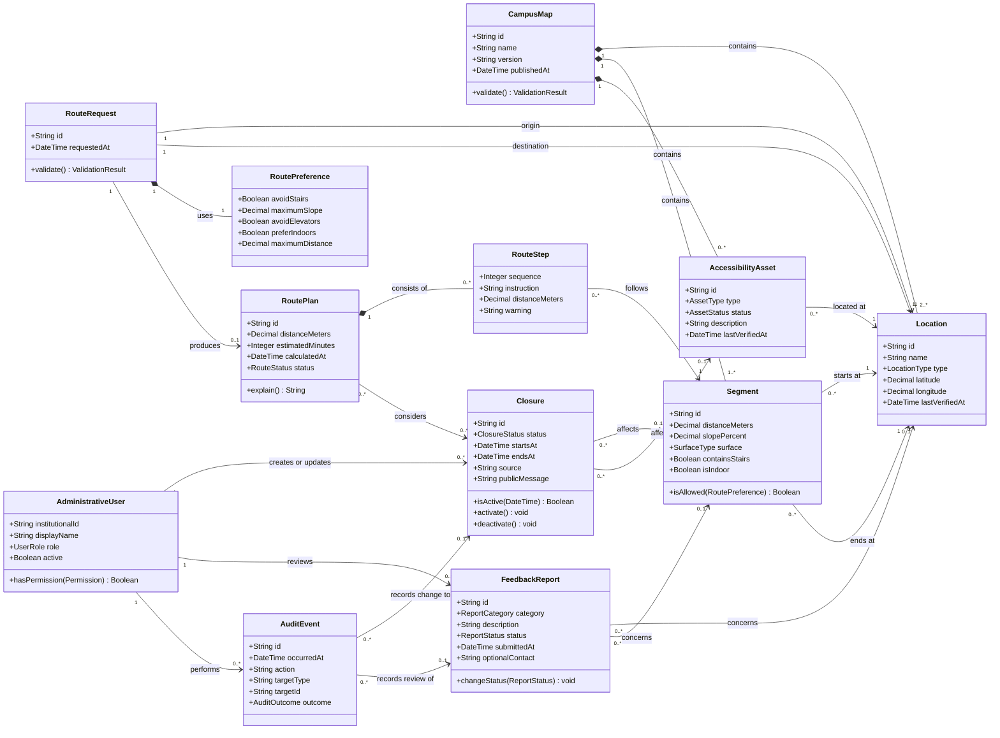

# Sample Use Case and Class Diagrams

## AccessPath: Accessible Campus Navigation

> **Purpose of this document:** This is a fictional example for CMPT 475. It demonstrates how use case and class diagrams can communicate a system's behavior and conceptual structure. The diagrams use [Mermaid](https://mermaid.js.org/) so they render in GitHub Markdown.

These diagrams support the [Sample Requirements Document](./Sample%20Requirements%20Document.md) and [Sample Project Plan](./Sample%20Project%20Plan.md). They are analysis and design artifacts, not substitutes for written requirements, acceptance criteria, or implementation documentation.

## 1. Diagram Scope

The diagrams describe the minimum viable product for AccessPath:

- Visitors plan routes using accessibility constraints.
- Visitors inspect route details and report possible data problems.
- Editors maintain temporary closures and review public reports.
- Administrators manage editor access and inspect audit records.
- An external identity provider authenticates administrative users.

The diagrams do not include future capabilities such as indoor positioning, native mobile applications, additional campuses, or automatic barrier detection.

## 2. Use Case Diagram

Mermaid does not provide a native UML use case diagram type, so the following system-context flowchart uses actors, a system boundary, and use-case-shaped nodes to communicate the same relationships.

### 2.1 Actors

| Actor | Description | Goals |
|---|---|---|
| Visitor | Any student, employee, or campus visitor using public features | Find a compatible route, understand warnings, report inaccurate information |
| Facilities Editor | An authenticated staff member authorized to maintain operational accessibility information | Publish closures and review feedback |
| Administrator | An authenticated person with permission to manage access and inspect system records | Manage editors, audit privileged activity, export records |
| Identity Provider | An external institutional authentication service | Verify administrative identities |

### 2.2 Use case summary

| ID | Use case | Primary actor | Outcome | Related requirements |
|---|---|---|---|---|
| UC-01 | Plan an accessible route | Visitor | A qualifying route is displayed, or the system clearly explains that none is known | FR-01–FR-10 |
| UC-02 | Set accessibility preferences | Visitor | Selected constraints and preferences influence route calculation | FR-03–FR-05, FR-10 |
| UC-03 | View route details and warnings | Visitor | The user receives map and text directions, dependencies, warnings, and freshness information | FR-06–FR-09, FR-13–FR-15 |
| UC-04 | Report a barrier or map error | Visitor | An unverified report is recorded for later review | FR-22–FR-26 |
| UC-05 | Sign in | Editor or Administrator | The user's identity and role are established | FR-27–FR-30 |
| UC-06 | Manage temporary closures | Editor | A closure is created, changed, activated, deactivated, or expired | FR-16–FR-21 |
| UC-07 | Review feedback reports | Editor | A report receives a review status without automatically changing map data | FR-24–FR-25 |
| UC-08 | Manage editor access | Administrator | Editor permissions are granted or removed | FR-28–FR-29 |
| UC-09 | Review audit history | Administrator | Privileged changes can be inspected | FR-21, NFR-23 |
| UC-10 | Export administrative data | Editor or Administrator | Authorized records are exported in a documented format | FR-31 |

## 3. Detailed Use Cases

A diagram shows relationships at a glance. A use case specification adds the behavior, conditions, and exceptions required to build and test the system.

### UC-01: Plan an Accessible Route

| Field | Description |
|---|---|
| Primary actor | Visitor |
| Goal | Obtain a route between two campus locations that respects selected hard constraints |
| Trigger | The visitor chooses to plan a route |
| Preconditions | Campus route data is available; the public application is operating |
| Success postcondition | A qualifying route and its details are displayed |
| Minimal guarantee | The system does not silently return a route that violates a selected hard constraint |

#### Main success flow

1. The visitor selects an origin.
2. The visitor selects a different destination.
3. The visitor selects accessibility constraints and preferences.
4. The system validates the request.
5. The system removes segments that violate hard constraints or active closures.
6. The system calculates and ranks the remaining route candidates.
7. The system displays the selected route, distance, estimated time, text directions, and map.
8. The system displays relevant barriers, elevator dependencies, closures, data freshness, and route explanation.
9. The visitor may change preferences and calculate another route.

#### Alternate and exception flows

- **A1 — Same origin and destination:** At step 4, the system asks the visitor to select two different locations.
- **A2 — No compatible route:** At step 6, the system states that no qualifying route is known and identifies the constraint or data limitation when possible.
- **A3 — Stale data:** At step 8, the system warns the visitor that relevant information has exceeded its review interval.
- **A4 — Map tiles unavailable:** At step 7, the system continues to provide usable text directions and route details.
- **A5 — Route service failure:** The system provides an actionable error and does not display a previous result as though it were current.

#### Acceptance evidence

- Automated tests confirm that hard constraints are never violated in the route validation set.
- End-to-end tests cover valid, invalid, no-route, stale-data, and unavailable-map cases.
- Representative users attempt the workflow during usability and field-route evaluations.

### UC-04: Report a Barrier or Map Error

| Field | Description |
|---|---|
| Primary actor | Visitor |
| Goal | Notify authorized personnel of potentially inaccurate accessibility information |
| Trigger | The visitor selects **Report a problem** from a location or route step |
| Preconditions | The feedback service is available |
| Success postcondition | An unverified feedback report is recorded and acknowledged |
| Minimal guarantee | No public report directly changes verified route data |

#### Main success flow

1. The visitor selects a location or route step.
2. The visitor selects a report category.
3. The visitor enters a description.
4. The visitor may provide contact information.
5. The system validates the submission and applies abuse controls.
6. The system stores the report with an **Unverified** status.
7. The system confirms receipt and explains that the report requires review.

#### Alternate and exception flows

- **A1 — Missing required information:** The system identifies the missing category or description.
- **A2 — Rate limit exceeded:** The system rejects the submission without exposing internal security details.
- **A3 — Storage failure:** The system informs the visitor that the report was not received and provides a retry action.
- **A4 — Duplicate report:** An Editor may later mark the report as a duplicate of an existing report.

### UC-06: Manage Temporary Closures

| Field | Description |
|---|---|
| Primary actor | Facilities Editor |
| Goal | Publish a temporary condition that affects route calculation |
| Trigger | An authenticated Editor selects **New closure** or opens an existing closure |
| Preconditions | The Editor is authenticated and authorized; the affected asset or segment exists |
| Success postcondition | The closure is stored, audited, and reflected in route calculation within 60 seconds |
| Minimal guarantee | An invalid or unauthorized change does not alter active route data |

#### Main success flow

1. The Editor signs in through the institutional identity provider.
2. The Editor selects an affected path, entrance, elevator, or other accessibility asset.
3. The Editor enters the closure status, effective time, expected end time if known, source, and public explanation.
4. The system validates the data and the Editor's authorization.
5. The system stores and activates the closure.
6. The system records the change in the audit history.
7. New route calculations avoid the affected element.
8. The system confirms publication to the Editor.

#### Alternate and exception flows

- **A1 — Unauthorized actor:** The system rejects the operation and records the failed attempt.
- **A2 — Invalid time range:** The system rejects an end time earlier than the start time.
- **A3 — Unknown end time:** The closure remains active until an Editor resolves it.
- **A4 — Scheduled closure:** The closure is stored immediately but affects routing only during its effective period.
- **A5 — Update propagation failure:** The system alerts an operator and does not claim that the closure is active until propagation succeeds.

## 4. Conceptual Class Diagram

The class diagram models the principal domain concepts and their relationships. It intentionally omits framework classes, database tables, HTTP controllers, user-interface components, and vendor-specific services.

## 5. Class Responsibilities

| Class | Responsibility | Important rules |
|---|---|---|
| `CampusMap` | Own the published campus routing dataset | A new version must pass validation before publication |
| `Location` | Represent a selectable or graph-relevant campus place | Coordinates and type must be valid |
| `Segment` | Represent a traversable connection between two locations | Accessibility attributes determine whether a route may use it |
| `AccessibilityAsset` | Represent infrastructure such as a ramp, entrance, or elevator | Status and verification time must be visible to route logic and users |
| `Closure` | Represent a temporary condition affecting an asset or segment | Must have a valid time range and source; active closures exclude affected elements |
| `RouteRequest` | Capture a validated routing question | Origin and destination must be different and supported |
| `RoutePreference` | Capture hard constraints and optimization preferences | Hard constraints must never be silently relaxed |
| `RoutePlan` | Represent a route result or a no-route result | Must explain significant warnings and limitations |
| `RouteStep` | Describe one ordered portion of a route | Must have both visual and textual representation |
| `FeedbackReport` | Capture an unverified user observation | Cannot directly modify verified route data |
| `AdministrativeUser` | Represent an authenticated Editor or Administrator | Server-side authorization controls every privileged action |
| `AuditEvent` | Preserve evidence of a privileged action | Records actor, action, target, time, and outcome without secrets |

## 6. Important Modeling Decisions

### 6.1 A closure affects either a segment or an asset

A path closure applies naturally to a `Segment`; an elevator outage applies to an `AccessibilityAsset`. The model allows either association. Application validation must require exactly one valid target even though Mermaid cannot express that exclusive constraint directly.

### 6.2 Preferences contain both constraints and preferences

`avoidStairs` is a hard constraint: a route containing stairs is not acceptable. A preference such as `preferIndoors` may influence ranking without disqualifying every outdoor segment. The implementation should model this distinction explicitly even though the simplified diagram places both in `RoutePreference`.

### 6.3 Public reports do not change trusted data

`FeedbackReport` is deliberately separate from `Closure`, `Segment`, and `AccessibilityAsset`. An Editor must investigate a report before changing verified data or publishing a closure.

### 6.4 A route plan can represent failure

`RoutePlan.status` can represent a successful route, no compatible route, insufficient data, or a calculation error. This prevents the absence of a route from being represented only as `null` and supports clear user-facing explanations.

### 6.5 The diagram is conceptual, not a database schema

The eventual implementation may use additional identifiers, join tables, value objects, API models, or persistence structures. Those implementation details should preserve the domain rules shown here but do not need to reproduce every conceptual class as one database table.

## 7. Sample Enumerations

The diagram refers to several types whose possible values should be documented.

| Enumeration | Sample values |
|---|---|
| `LocationType` | Building, Entrance, Intersection, Landmark |
| `SurfaceType` | Paved, Concrete, Brick, Gravel, IndoorFloor, Unknown |
| `AssetType` | Ramp, Elevator, AccessibleEntrance, AutomaticDoor |
| `AssetStatus` | Available, Unavailable, Restricted, Unknown |
| `ClosureStatus` | Draft, Scheduled, Active, Resolved, Canceled |
| `RouteStatus` | Available, NoCompatibleRoute, InsufficientData, Failed |
| `ReportCategory` | Barrier, Closure, IncorrectAttribute, MissingPath, Other |
| `ReportStatus` | Unverified, UnderReview, Resolved, Rejected, Duplicate |
| `UserRole` | Editor, Administrator |
| `AuditOutcome` | Succeeded, Rejected, Failed |

## 8. Traceability Examples

| Model element | Requirement or use case | Verification idea |
|---|---|---|
| `RoutePreference.avoidStairs` and `Segment.containsStairs` | UC-01, FR-03–FR-05 | Generate route graphs containing stairs and prove excluded segments never appear |
| `Closure.isActive()` | UC-06, FR-16–FR-20 | Test scheduled, active, expired, canceled, and open-ended closures |
| `FeedbackReport.status` | UC-04, FR-22–FR-25 | Confirm every new public report begins as Unverified |
| `AdministrativeUser.hasPermission()` | UC-05–UC-10, FR-27–FR-30 | Test every privileged operation with Visitor, Editor, and Administrator permissions |
| `AuditEvent` | UC-06–UC-10, FR-21, NFR-23 | Verify successful and rejected privileged actions create complete records |
| `RoutePlan.status` | UC-01, FR-08 | Test compatible, impossible, insufficient-data, and service-failure outcomes |

## 9. Notes for Students

For your own diagrams:

- Define the system boundary before selecting use cases.
- Name use cases as actor goals, not interface screens.
- Include external systems only when they interact with the system being designed.
- Keep the class diagram focused on concepts and responsibilities that matter to the problem.
- Show meaningful multiplicities and ownership relationships.
- Do not add classes only to make the diagram appear complex.
- Document important rules that the diagram notation cannot express.
- Keep terminology consistent across diagrams, requirements, code, tests, and presentations.
- Update the diagrams when the team's understanding changes.

